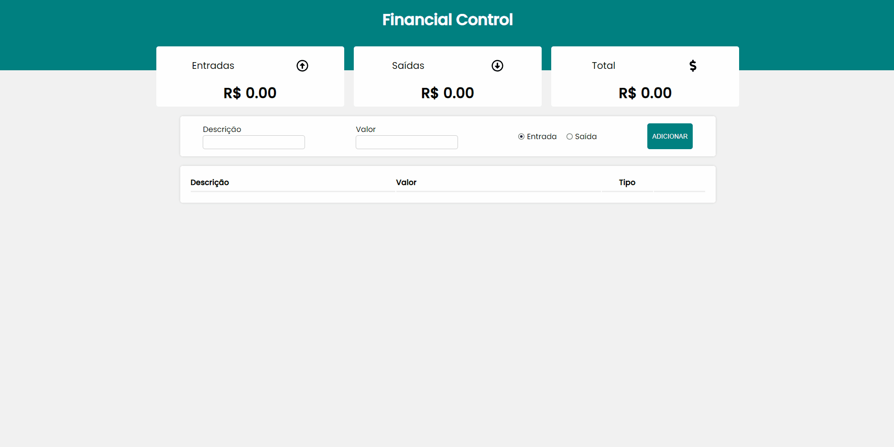

# Financial Control

Este é um projeto onde o seu propósito é anotar todas as entradas e saídas de dinheiro e salvar elas com uma breve descrição. Com base no que o usuário insere é feito um cálculo onde é subtraído das entradas os valores das saídas e mostra o resultado deste cálculo, informando como está a situação financeira até o momento.

<h2>Segue um GIF mostrando o projeto!</h2>
  

# 
<h2>Um pouco mais sobre o desenvolvimento...</h2>

Este projeto é feito em React.Js. E como ele foi desenvolvido nesse framework, foi aproveitado ao máximo as ferramentas que ele nos oferece, onde tudo em tela é um componente diferente, e também os estados são compartilhados entre os diversos componentes. Com isso cada componente recebe a informação que lhes compete e executa a função para qual foi proposto.
